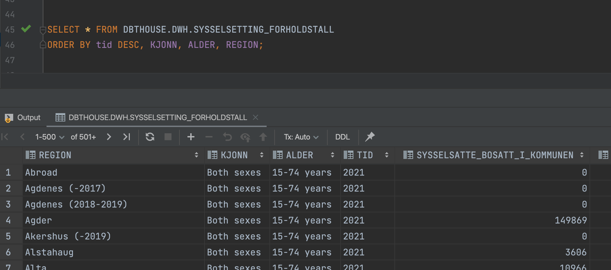
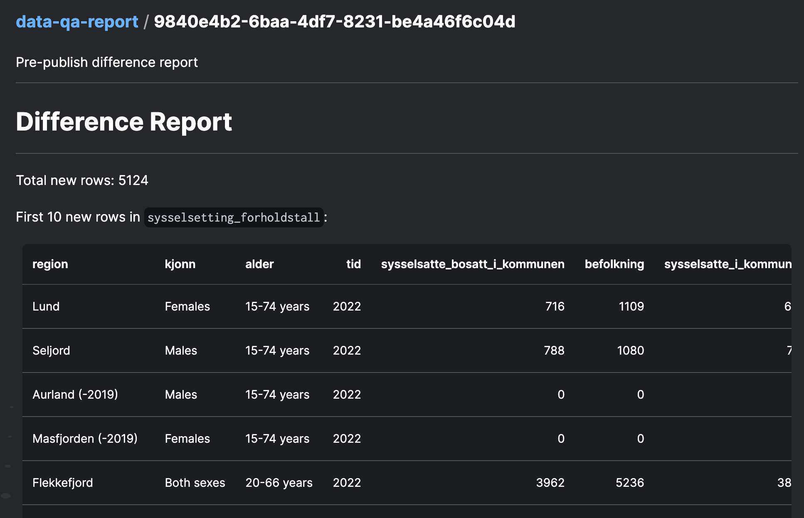
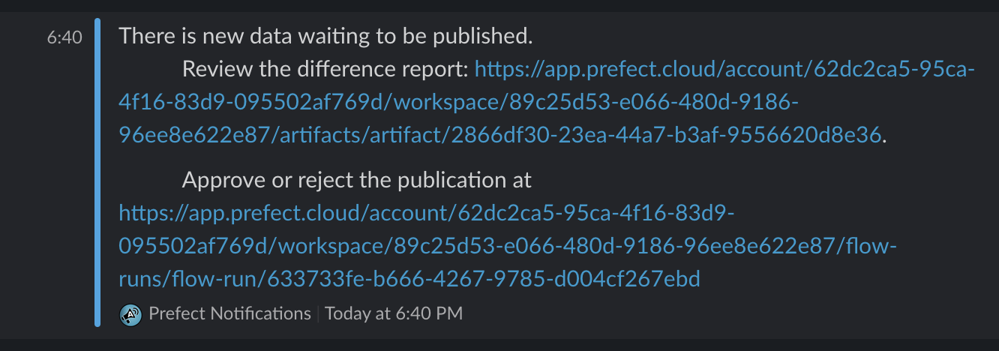
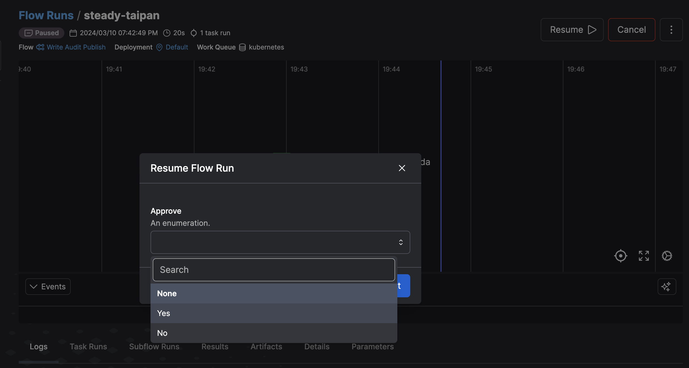
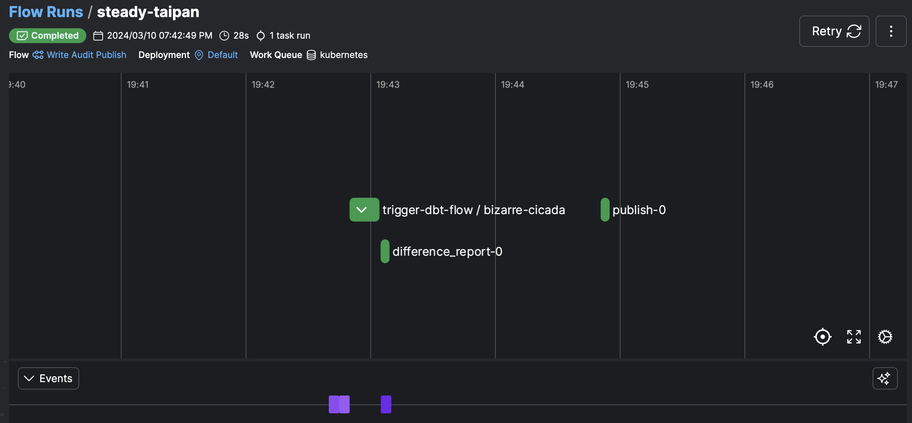
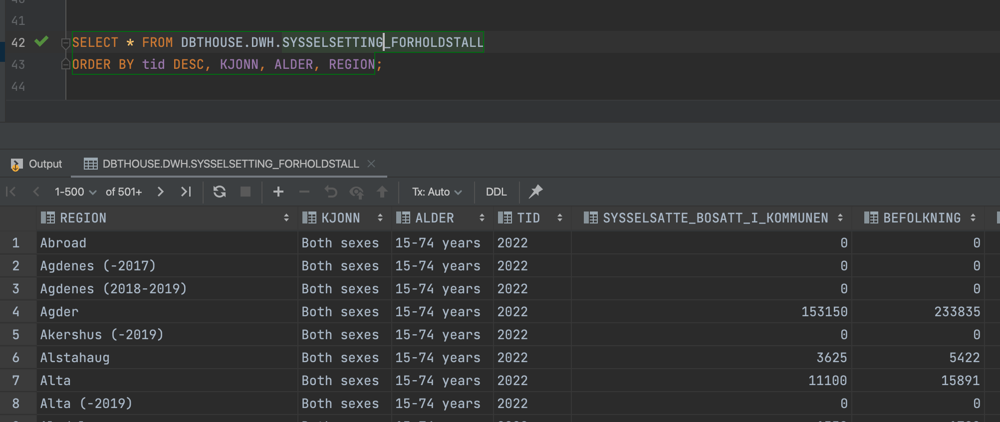

# Write - Audit - Publish pattern for dbt+Prefect

Write-Audit-Publish patterns are very sensible in a lot of cases, and they work nicely together with blue-green deployments.

Here, we implement a write-audit-publish pattern with Prefect, dbt and snowflake. We run our dbt models via Prefect, but in a prefixed schema (`develop_` prefix). After the dbt run is finished, Prefect compiles a small report of the differences between the new data now residing in the prefixed schema `develop_dwh`, and the old data currently in the unprefixed `dwh` schema, and registers it as an artifact.

Then, it pauses the flow and notifies slack that some new data is in the pipeline and must be approved for publishing. The notification includes a link to the report artifact, and the link to the now paused flow run where it can be continued by clicking "Resume" and choosing "Yes" on the approval action dropdown.

This will invoke a function that runs a schema swap between `develop_dwh` and `dwh`, essentially switching the contents of the schemas. Note that it also swaps the access, so make sure the two schemas have identical permissions or that the necessary grants/revokes are run.

The dbt project lives in the `dbt` folder, and the prefect flow is under `flows/write-audit-publish/wap.py`. The `Dockerfile` is the docker image that was used to run the flow.

## Walkthrough

1. The relevant table before we start running, time series ends at 2021:

2. The flow generates a report summarizing the differences. In reality people probably want to run their own ad-hoc queries or check a dedicated BI Dashboard before approving.

3. The flow generates a Slack notification letting developers know about the new data waiting to be published:

4. The developer can resume the flow and choose whether to publish:

5. The flow is resumed and a schema swap command is executed:

6. The data after the schema swap - now including 2022 data:

